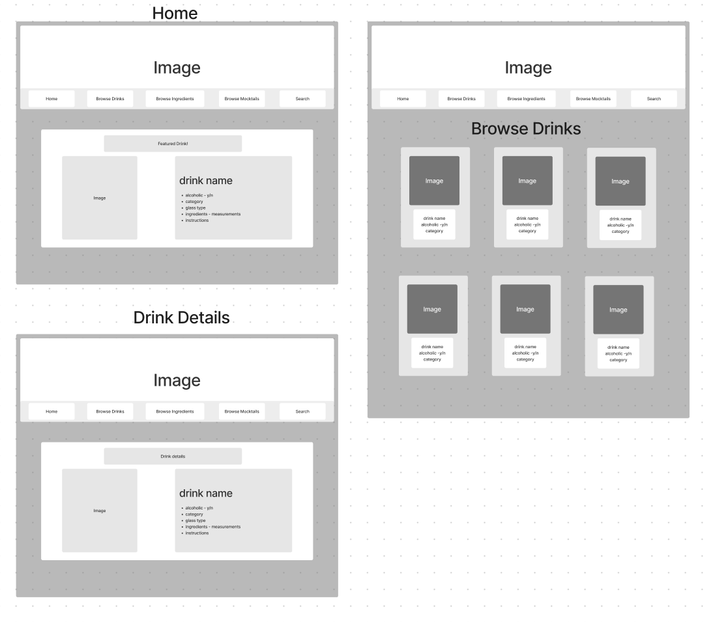
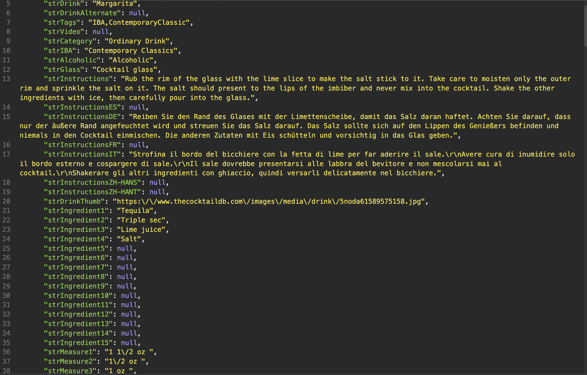

# Tequila_Mockingbird
Project 2 API call using React

# Description

This website is going to be using an API call using React to pull and display information from (https://www.thecocktaildb.com/api.php). You will be able to search cocktails by name or browse by alcohol type, ingredient type, and Drink type including Mocktails!

The purpose of this website is to help those wishing to explore different drinks and expand their palate. In the image below you can see a general layout of how the home page, drink display page, and drink details page will look along with a link to the relevant wireframes and component hierarchy diagram.
(https://www.figma.com/file/pHmgtLLb3UP0Dk0b1l6SYD/Tequila-Mockingbird?node-id=0%3A1)

The following link will take you to my Trello Board where you can see how I have scheduled my week to complete my project. 
(https://trello.com/b/S89YTxjL/tequila-mockingbird)

# Technologies Used

This project uses an API call from (https://www.thecocktaildb.com/api.php), React links and routers, Javascript, and CSS. Below is a snippet of the code returned by the API.

# Getting Started

When you start the website you will see a navigation bar at the top where you can return to home, browse drinks, ingredients, and drink types, or search for a specific drink. From there you will see a few different drink/ingredient cards shown which you can click through to see further details and instructions. 

# Contribution Guidelines

If you'd like to contribute you can fork and clone this repository, or reach out with any improvements or suggestions!